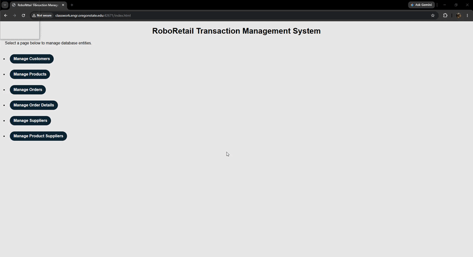

## Robo Retail Transactional Database
- * All CRUD functionalities updating the database (Customers only shown for demo GIF length) *

## Database and TechStack:
- MySQL
- EJS
- Express

## Project Overview:
- This project implements a transactional database for a made up business called 'Robo Retail'. The program creates a transactional database that accurately and efficiently handles CRUD operations while ensuring no data anomalies arise during usage.
- The build is accompanied by a frontend client side GUI created with ejs. The backend database is hosted on Oregon State University's flip servers via MySQL.
- DDL.SQL: This file creates the entity tables that will be filled with customer information. It includes an intersection table and several primary / foreign key handling functions. This file also fills the tables with sample data to display an example of our database design usage and implementation. 
- DML.SQL: Aims to connect relevant tables with each other and ensure proper handling on the frontend user interface.
- PL.SQL: This file stores all the CRUD procedures for all tables (Except OrderDetails).
- Group1_Webapp: Holds all the frontend code. This includes the DB connector that has the credentials to log into MySQL to populate data (currently sanitized), views folder which contains each EJS file for each table and the style sheet.
- Group1_Project Step 5 PDF: Contains our finalized written proposal of the database design, our debugging / revision processes decisions along with entity-relationship design, and schema. 

- This work done here represents the collective effort of Hossian Nahid, Kevin Sun, and Jacob Wahl. This project took place over 11 weeks in OSU's CS_340 taught by Dr. Michael Curry.
- The goal of the course is to teach the fundamentals of database design, SQL, and connecting it all with web development.
- Note to the team: Thanks for all the hard work!

## Citations:
 - ChatGPT
 - Claude
 - Microsoft CoPilot
 - Canvas via CS340 taught by Dr. Curry.
 - W3 Schools:
 - AI tools were used to generate code for SQL queries and SQL stored procedures. AI tools were also consulted to brainstorm ideas, debug, and establish connection with our DB.
 - Example Prompt: "Write a stored procedure using this [DATBASE_SCHEMA] called [TITLE OF SP] that allows a user to [CUD OPERATION] to the table.
 - 		            Write test queries to ensure the procedure is working correctly."
 - All AI usage was managed, reviewed, and guided by at least one team member to ensure accuracy and procedure intent.
 -
 - Source URLS: 
 - W3 schools SQL: https://www.w3schools.com/sql/default.asp
 - W3 Schools CSS: https://www.w3schools.com/css/
 - Canvas: https://canvas.oregonstate.edu/courses/2042369/assignments/10464646?module_item_id=26640125

